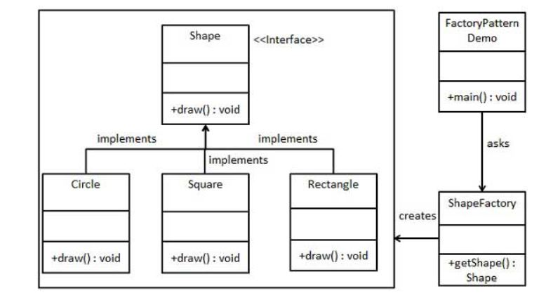

# Factory Design Pattern

Factory pattern is one of the most used design patterns in Java. This type of design pattern comes under creational pattern as this pattern provides one of the best ways to create an object.

In Factory pattern, we create object without exposing the creation logic to the client and refer to newly created object using a common interface. It says that just define an interface or abstract class for creating an object but let the subclasses decide which class to instantiate. The Factory Method Pattern is also known as Virtual Constructor.

## Advantage of Factory design pattern
+ Factory Method Pattern allows the sub-classes to choose the type of objects to create.

+ It promotes the loose-coupling by eliminating the need to bind application-specific classes into the code. That means the code interacts solely with the resultant interface or abstract class, so that it will work with any classes that implement that interface or that extends that abstract class.

## Usage of Factory design pattern
+ When a class doesn't know what sub-classes will be required to create.

+ When a class wants that its sub-classes specify the objects to be created.

+ When the parent classes choose the creation of objects to its sub-classes.

## Implementation

